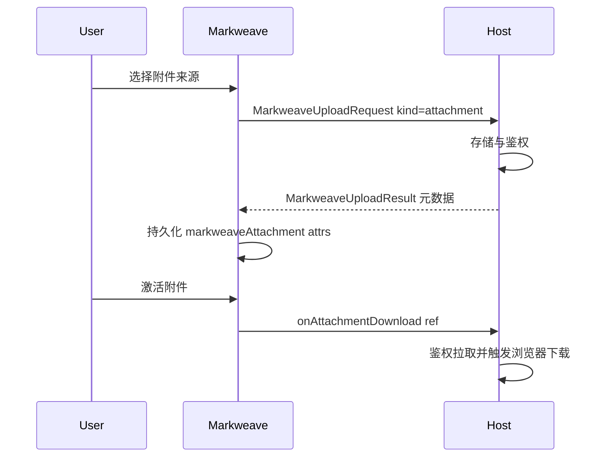

# 附件上传与下载协议

本文是 Markweave 附件能力的宿主侧规范。Markweave 不负责对象存储、CDN 分发或鉴权下载。接入方负责上传存储、返回可持久化元数据，并在用户激活附件时执行真实下载。

框架接线示例仍在 React / Vue 2 / Vue 3 集成指南中。字段语义以本文为准，避免六份集成文档继续漂移。

## 当前状态

- `markweaveAttachment` 节点、HTML/Markdown 往返和共享上传类型已经存在。
- Slash **附件** 插入空的行内占位；宿主上传由 NodeView（文件选择器）发起，不再使用悬浮 UploadPanel。
- 适配器渲染空态 / 上传中 / 完成态 NodeView；点击芯片或下载控件时调用宿主 `onAttachmentDownload`。
- 上传请求可带可选 `onProgress`；未提供时上传中 UI 显示不确定转圈。
- 未提供宿主下载回调时，Markweave 仅对安全的 `http(s)` `src` 新开标签页（`noopener,noreferrer`）。不透明定位符必须由宿主处理。

## 职责边界

| 角色 | 负责 |
| --- | --- |
| Markweave | 组装上传请求、写入附件节点属性、序列化文档，并在接线后调用宿主下载回调 |
| 接入方 | 存储、鉴权、病毒扫描、大小/MIME 策略、返回元数据，以及真实下载体验 |



## 上传协议

复用公开上传 API，不要另起平行的附件专用请求类型。

### 请求

```ts
interface MarkweaveUploadProgress {
  loaded: number;
  total: number | null;
}

interface MarkweaveUploadRequest {
  kind: "image" | "video" | "attachment";
  trigger:
    | "slash-command"
    | "image-insert"
    | "image-replace"
    | "video-insert"
    | "attachment-insert";
  source: {
    type: "url" | "absolute-path" | "relative-path" | "base64" | "file";
    value?: string;
    file?: File;
    mimeType?: string;
  };
  onProgress?: (progress: MarkweaveUploadProgress) => void;
}
```

附件约定：

| 字段 | 约定 |
| --- | --- |
| `kind` | 必须为 `"attachment"`。 |
| `trigger` | Slash 附件与行内占位使用 `"attachment-insert"`。 |
| `source.type === "file"` | 必须走 `onSlashCommandUpload`。Markweave 不保存文件。 |
| `onProgress` | 可选。宿主上传过程中回调，NodeView 可显示百分比；未提供时显示不确定转圈与文件名/大小。 |
| url/path/base64 | 可直通，但宿主仍可把 `src` 改写成稳定的不透明定位符。默认行内占位仅支持本地文件。 |

辅助方法：

```ts
import { createMarkweaveAttachmentUploadRequest } from "markweave";

const request = createMarkweaveAttachmentUploadRequest({
  type: "file",
  file,
  mimeType: file.type,
});
// kind: "attachment", trigger: "attachment-insert"
```

### 结果

```ts
interface MarkweaveUploadResult {
  src: string;
  name?: string;
  alt?: string;
  title?: string;
  mimeType?: string;
  size?: number;
}
```

附件语义：

| 字段 | 附件要求 | 含义 |
| --- | --- | --- |
| `src` | 必填 | 不透明资源定位符。可以是 HTTPS URL、鉴权 path 或宿主私有 id。不是 Markweave 本地存储承诺。 |
| `name` | 强烈建议 | 展示文件名，最好包含扩展名。 |
| `mimeType` | 强烈建议 | MIME；扩展类型由 `name` / `mimeType` 推导，不单独新增 `extension` 属性。 |
| `size` | 强烈建议 | 字节数。 |
| `alt` / `title` | 可选 | 图像/视频语义字段，附件可忽略。 |

### 节点属性映射

```ts
import { attrsFromMarkweaveAttachmentUploadResult } from "markweave";

attrsFromMarkweaveAttachmentUploadResult(result);
// => { src, name, mimeType, size }
```

规范映射：

```ts
{
  src: result.src,
  name: result.name ?? derivedFileName(result.src),
  mimeType: result.mimeType ?? null,
  size: typeof result.size === "number" ? result.size : null,
}
```

### 持久化文档形态

附件节点序列化为：

```html
<a
  href="{src}"
  class="markweave-attachment"
  data-markweave-attachment="true"
  data-markweave-attachment-name="{name}"
  data-markweave-mime-type="{mimeType}"
  data-markweave-attachment-size="{size}"
>{name}</a>
```

不要把鉴权 token 写入 Markdown/HTML。只持久化宿主在下载时可再次鉴权的稳定定位符。

## 下载协议

### 回调

```ts
interface MarkweaveAttachmentRef {
  src: string;
  name: string | null;
  mimeType: string | null;
  size: number | null;
}

interface MarkweaveAttachmentDownloadContext {
  mode: "live" | "view";
  event: MouseEvent;
}

type MarkweaveAttachmentDownloadHandler = (
  attachment: MarkweaveAttachmentRef,
  context: MarkweaveAttachmentDownloadContext,
) => void | Promise<void>;
```

适配器 prop：

| 适配器 | Prop |
| --- | --- |
| React | `onAttachmentDownload` |
| Vue 2 / Vue 3 | `onAttachmentDownload` / `on-attachment-download` |

### 运行时规则

1. 宿主提供 `onAttachmentDownload` 时，Markweave 拦截附件激活（接线后的 click / Enter）并调用宿主，不默认 `window.open(src)`。
2. 未提供回调时，仅当 `src` 为安全的 `http:` / `https:` 才可走只读链接安全打开路径；非 HTTP 定位符必须由宿主下载回调处理。
3. 鉴权拉取、重定向、Blob、`Content-Disposition`、另存为体验均由宿主负责。
4. 文档序列化仍使用 `href=src` 与 data 属性，保证内容可移植，不把下载凭证写进文档。

### 最小宿主示例

```ts
import type {
  MarkweaveAttachmentDownloadHandler,
  MarkweaveSlashCommandUploadHandler,
} from "markweave";

const handleUpload: MarkweaveSlashCommandUploadHandler = async (request) => {
  if (request.kind !== "attachment") {
    // 处理 image/video...
  }

  if (request.source.type !== "file" || !request.source.file) {
    return {
      src: request.source.value ?? "",
      name: request.source.value?.split("/").filter(Boolean).at(-1),
      mimeType: request.source.mimeType,
    };
  }

  const form = new FormData();
  form.append("file", request.source.file);
  const response = await fetch("/api/attachments", { method: "POST", body: form });
  if (!response.ok) {
    throw new Error("Attachment upload failed.");
  }

  // 期望 JSON: { src, name, mimeType, size }
  return response.json();
};

const handleDownload: MarkweaveAttachmentDownloadHandler = async (attachment) => {
  const response = await fetch(`/api/attachments/download?src=${encodeURIComponent(attachment.src)}`, {
    credentials: "include",
  });
  if (!response.ok) {
    throw new Error("Attachment download failed.");
  }

  const blob = await response.blob();
  const objectUrl = URL.createObjectURL(blob);
  const anchor = document.createElement("a");
  anchor.href = objectUrl;
  anchor.download = attachment.name ?? "attachment";
  anchor.click();
  URL.revokeObjectURL(objectUrl);
};
```

## 与图片 / 视频的差异

| 关注点 | 附件 | 图片 / 视频 |
| --- | --- | --- |
| 宿主上传 | 本地文件必须 | 本地文件必须 |
| 空占位 NodeView | 已支持（点击选文件上传） | 已支持 |
| 结果主字段 | `src`、`name`、`mimeType`、`size` | `src` 加视觉字段（`alt`/`title`/`mimeType`） |
| 激活行为 | 宿主下载回调 | 预览 / 播放 / 媒体控件 |
| Slash 默认 UI | 插入空占位 | 插入空占位 |

## 安全

- 不要在包内新增生产上传端点或存储后端。
- 宿主侧校验大小、MIME 与返回定位符。
- 优先使用可再次鉴权的不透明 `src`，避免把长时效签名 URL 写进已保存 Markdown。
- 密钥不得进入文档属性、props 或前端包。

另见 `docs/standards/security.md`。

## 宿主接入清单

1. 为 `kind: "attachment"` 实现 `onSlashCommandUpload`（也可同时处理其它媒体类型）。
2. 将返回的 `src` / `name` / `mimeType` / `size` 持久化到文档存储。
3. 为不透明定位符与鉴权下载实现 `onAttachmentDownload`。
4. 仅对公开 `http(s)` 附件依赖 Markweave fallback。
