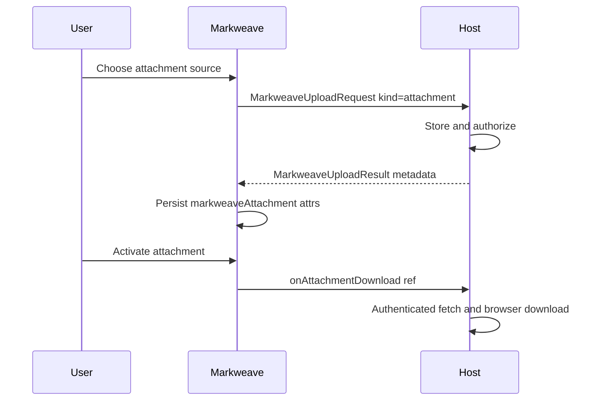

# Attachment Upload And Download Protocol

This guide is the normative host contract for Markweave attachments. Markweave does not own object storage, CDN delivery, or authenticated downloads. Hosts upload files, return persistent metadata, and perform the real download when the user activates an attachment.

Framework wiring examples still live in the React / Vue 2 / Vue 3 integration guides. Keep field semantics here so the six integration guides do not drift.

## Status

- The `markweaveAttachment` node, HTML/Markdown round-trip, and shared upload types already exist.
- Slash **Attachment** inserts an empty inline placeholder; the host upload runs from the NodeView (file picker), not a floating UploadPanel.
- Adapters render empty / uploading / filled NodeView states and call host `onAttachmentDownload` when the chip or download control is activated.
- Upload requests may include optional `onProgress`; without it, the uploading UI shows an indeterminate spinner.
- Without a host download handler, Markweave only opens safe `http(s)` `src` values in a new tab (`noopener,noreferrer`). Opaque locators require a host handler.

## Responsibility Boundary

| Actor | Owns |
| --- | --- |
| Markweave | Slash/upload request shaping, attachment node attrs, document serialization, calling the host download handler when wired |
| Host | Storage, auth, virus scanning, size/MIME policy, returned metadata, and the actual download UX |



## Upload Protocol

Reuse the public upload API. Do not invent a parallel attachment-only request type.

### Request

```ts
interface MarkweaveUploadProgress {
  loaded: number;
  total: number | null;
}

interface MarkweaveUploadRequest {
  kind: "image" | "video" | "attachment";
  trigger:
    | "slash-command"
    | "image-insert"
    | "image-replace"
    | "video-insert"
    | "attachment-insert";
  source: {
    type: "url" | "absolute-path" | "relative-path" | "base64" | "file";
    value?: string;
    file?: File;
    mimeType?: string;
  };
  onProgress?: (progress: MarkweaveUploadProgress) => void;
}
```

Attachment rules:

| Field | Contract |
| --- | --- |
| `kind` | Must be `"attachment"`. |
| `trigger` | Slash Attachment and the inline placeholder use `"attachment-insert"`. |
| `source.type === "file"` | Requires `onSlashCommandUpload`. Markweave never stores the file. |
| `onProgress` | Optional. Hosts should call it while uploading so the NodeView can show a percentage. If omitted, Markweave shows an indeterminate spinner with file name/size. |
| `source` url/path/base64 | May resolve directly, but hosts may rewrite `src` to a stable opaque locator. The default inline placeholder is file-only. |

Helper:

```ts
import { createMarkweaveAttachmentUploadRequest } from "markweave";

const request = createMarkweaveAttachmentUploadRequest({
  type: "file",
  file,
  mimeType: file.type,
});
// kind: "attachment", trigger: "attachment-insert"
```

### Result

```ts
interface MarkweaveUploadResult {
  src: string;
  name?: string;
  alt?: string;
  title?: string;
  mimeType?: string;
  size?: number;
}
```

Attachment semantics:

| Field | Required for attachments | Meaning |
| --- | --- | --- |
| `src` | Required | Opaque resource locator. May be an HTTPS URL, authenticated path, or host-private id. Not a Markweave storage promise. |
| `name` | Strongly recommended | Display file name, preferably including the extension. |
| `mimeType` | Strongly recommended | MIME type. Extension is derived from `name` / `mimeType`; Markweave does not add a separate `extension` attr. |
| `size` | Strongly recommended | Size in bytes. |
| `alt` / `title` | Optional | Image/video-oriented; ignore for attachments. |

### Node attribute mapping

```ts
import { attrsFromMarkweaveAttachmentUploadResult } from "markweave";

attrsFromMarkweaveAttachmentUploadResult(result);
// => { src, name, mimeType, size }
```

Canonical mapping:

```ts
{
  src: result.src,
  name: result.name ?? derivedFileName(result.src),
  mimeType: result.mimeType ?? null,
  size: typeof result.size === "number" ? result.size : null,
}
```

### Persistent document shape

Attachment nodes serialize as:

```html
<a
  href="{src}"
  class="markweave-attachment"
  data-markweave-attachment="true"
  data-markweave-attachment-name="{name}"
  data-markweave-mime-type="{mimeType}"
  data-markweave-attachment-size="{size}"
>{name}</a>
```

Auth tokens must not be written into Markdown/HTML. Persist only stable locators that the host can re-authorize at download time.

## Download Protocol

### Handler

```ts
interface MarkweaveAttachmentRef {
  src: string;
  name: string | null;
  mimeType: string | null;
  size: number | null;
}

interface MarkweaveAttachmentDownloadContext {
  mode: "live" | "view";
  event: MouseEvent;
}

type MarkweaveAttachmentDownloadHandler = (
  attachment: MarkweaveAttachmentRef,
  context: MarkweaveAttachmentDownloadContext,
) => void | Promise<void>;
```

Adapter prop names:

| Adapter | Prop |
| --- | --- |
| React | `onAttachmentDownload` |
| Vue 2 / Vue 3 | `onAttachmentDownload` / `on-attachment-download` |

### Runtime rules

1. When the host provides `onAttachmentDownload`, Markweave intercepts attachment activation (click / Enter once wired) and calls the handler. It does not default to `window.open(src)`.
2. When the handler is absent, Markweave may open only safe `http:` / `https:` `src` values through the existing readonly-link safety path. Non-HTTP locators require a host download handler.
3. The host owns authenticated fetch, redirects, Blob creation, `Content-Disposition`, and save-as UX.
4. Document serialization remains `href=src` plus data attributes so content stays portable without embedding download credentials.

### Minimal host example

```ts
import type {
  MarkweaveAttachmentDownloadHandler,
  MarkweaveSlashCommandUploadHandler,
} from "markweave";

const handleUpload: MarkweaveSlashCommandUploadHandler = async (request) => {
  if (request.kind !== "attachment") {
    // handle image/video...
  }

  if (request.source.type !== "file" || !request.source.file) {
    return {
      src: request.source.value ?? "",
      name: request.source.value?.split("/").filter(Boolean).at(-1),
      mimeType: request.source.mimeType,
    };
  }

  const form = new FormData();
  form.append("file", request.source.file);
  const response = await fetch("/api/attachments", { method: "POST", body: form });
  if (!response.ok) {
    throw new Error("Attachment upload failed.");
  }

  // Expected JSON: { src, name, mimeType, size }
  return response.json();
};

const handleDownload: MarkweaveAttachmentDownloadHandler = async (attachment) => {
  const response = await fetch(`/api/attachments/download?src=${encodeURIComponent(attachment.src)}`, {
    credentials: "include",
  });
  if (!response.ok) {
    throw new Error("Attachment download failed.");
  }

  const blob = await response.blob();
  const objectUrl = URL.createObjectURL(blob);
  const anchor = document.createElement("a");
  anchor.href = objectUrl;
  anchor.download = attachment.name ?? "attachment";
  anchor.click();
  URL.revokeObjectURL(objectUrl);
};
```

## Attachment Vs Image / Video

| Concern | Attachment | Image / Video |
| --- | --- | --- |
| Host upload | Required for local files | Required for local files |
| Empty placeholder NodeView | Supported (file click-to-upload) | Supported |
| Primary result fields | `src`, `name`, `mimeType`, `size` | `src` plus visual fields (`alt`/`title`/`mimeType`) |
| Activation | Host download handler | Preview / play / media controls |
| Slash default UI | Insert empty placeholder | Insert empty placeholder |

## Security

- Do not add package-owned upload endpoints or storage backends.
- Validate size, MIME, and returned locators on the host.
- Prefer opaque, re-authorizable `src` values over long-lived signed URLs in saved Markdown.
- Keep secrets out of document attrs, props, and client bundles.

See also `docs/standards/security.md`.

## Host Checklist

1. Implement `onSlashCommandUpload` for `kind: "attachment"` (and optionally other media kinds).
2. Persist returned `src` / `name` / `mimeType` / `size` in your document store.
3. Implement `onAttachmentDownload` for opaque locators and authenticated downloads.
4. Rely on Markweave fallback only for public `http(s)` attachments.